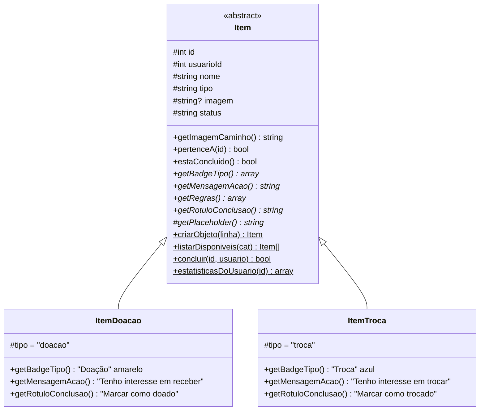
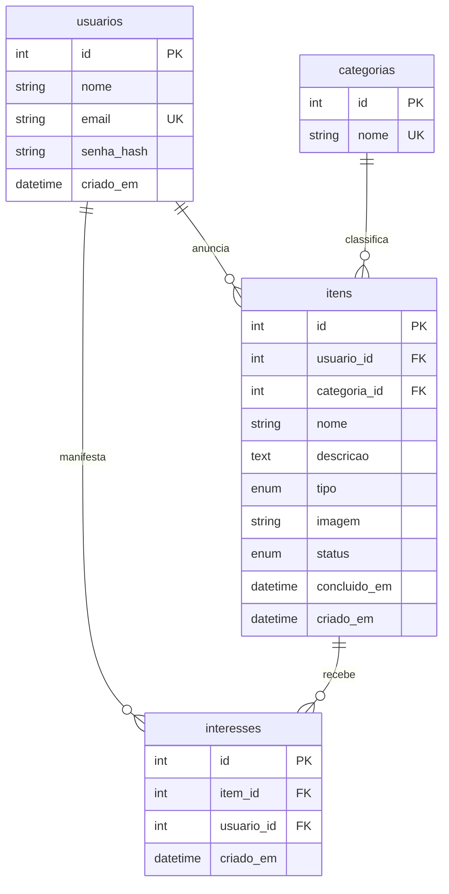

# Bazar Universitário

Plataforma web para estudantes da UNAERP **doarem e trocarem** livros, eletrônicos, materiais de estudo e móveis entre si.

Projeto acadêmico em **PHP 8 puro**, com **MVC**, **POO com herança e polimorfismo**, **MySQL via PDO** e **Bootstrap 5** na identidade visual da UNAERP (azul marinho `#0b3168`, amarelo ouro `#f4b41a` e branco). Não usa frameworks nem Composer.

---

## Sumário

1. [Funcionalidades](#1-funcionalidades)
2. [Tecnologias e requisitos](#2-tecnologias-e-requisitos)
3. [Estrutura de pastas](#3-estrutura-de-pastas)
4. [Como rodar localmente (XAMPP)](#4-como-rodar-localmente-xampp)
5. [Deploy no Google Cloud (Ubuntu 22.04 + Apache + MySQL)](#5-deploy-no-google-cloud)
6. [Arquitetura MVC](#6-arquitetura-mvc)
7. [POO: herança e polimorfismo](#7-poo-herança-e-polimorfismo)
8. [Segurança](#8-segurança)
9. [Rotas](#9-rotas)
10. [Banco de dados](#10-banco-de-dados)
11. [Desafios técnicos superados](#11-desafios-técnicos-superados)
12. [Roteiro da apresentação (15 min)](#12-roteiro-da-apresentação-15-min)
13. [Solução de problemas](#13-solução-de-problemas)

---

## 1. Funcionalidades

| Módulo | O que faz |
|---|---|
| **Autenticação** | Cadastro, login e logout. Senhas guardadas com `password_hash()` (bcrypt). |
| **Vitrine pública** | Grid de cards com foto, tipo (Doação/Troca), categoria e data. Filtro por categoria. Só mostra itens **disponíveis**. |
| **CRUD de itens** | Anunciar, ver, editar e excluir. Somente o **dono** edita, conclui ou exclui. |
| **Upload de foto** ⭐ | JPG, PNG ou WEBP de até 2 MB, com pré-visualização. Sem foto, aparece uma imagem padrão diferente para doação e para troca. |
| **Interesse** | Um aluno logado clica em "Tenho interesse". O dono vê nome e e-mail dos interessados para combinar a entrega. |
| **Concluir item** ⭐ | "Marcar como doado/trocado" tira o item da vitrine e o leva para o **histórico** do dono. É possível reabrir. |
| **Painel do usuário** ⭐ | `/dashboard` com indicadores (anunciados, na vitrine, concluídos, interesses recebidos), abas Ativos/Histórico e os últimos interesses recebidos. |

⭐ = requisitos bônus

---

## 2. Tecnologias e requisitos

| Camada | Tecnologia |
|---|---|
| Linguagem | PHP **8.1+** (Ubuntu 22.04 traz o 8.1; XAMPP atual traz 8.2) |
| Banco | MySQL 8 ou MariaDB 10.4+ |
| Servidor | Apache 2.4 com `mod_rewrite` |
| Front-end | Bootstrap 5.3 e Bootstrap Icons via CDN |
| Extensões PHP | `pdo_mysql`, `mbstring`, `fileinfo` (todas vêm ativas no XAMPP) |

---

## 3. Estrutura de pastas

```
bazar-universitario/
├── .htaccess                  # (XAMPP) bloqueia acesso a tudo fora de public/
├── config/
│   └── database.php           # credenciais via variáveis de ambiente, com padrão do XAMPP
├── public/                    # ÚNICA pasta exposta na web (DocumentRoot)
│   ├── index.php              # Front Controller: sessão, segurança, autoload, rotas
│   ├── .htaccess              # manda toda URL para o index.php
│   ├── assets/
│   │   ├── css/app.css        # tema UNAERP
│   │   ├── js/app.js          # pré-visualização da foto e confirmações
│   │   └── img/               # placeholders de doação e troca (SVG)
│   └── uploads/               # fotos enviadas (.htaccess bloqueia execução de scripts)
├── scripts/
│   └── auditar-views.php      # confere se toda saída das views está escapada
├── sql/
│   ├── schema.sql             # banco completo (instalação nova)
│   ├── migracao_etapa2.sql    # banco da Etapa 1 -> Etapa 2
│   ├── migracao_etapa3.sql    # banco da Etapa 2 -> Etapa 3
│   └── dados_demo.sql         # contas e itens para a apresentação
└── src/
    ├── Core/                  # infraestrutura reutilizável
    │   ├── Controller.php     # classe base: render, redirect, flash, CSRF, login
    │   ├── Database.php       # conexão PDO única (Singleton)
    │   ├── Router.php         # rotas GET/POST -> Controller@metodo
    │   └── Upload.php         # validação e gravação segura de imagens
    ├── Model/
    │   ├── Usuario.php
    │   ├── Categoria.php
    │   ├── Item.php           # classe ABSTRATA + persistência
    │   ├── ItemDoacao.php     # extends Item
    │   └── ItemTroca.php      # extends Item
    ├── Controller/
    │   ├── AuthController.php
    │   ├── HomeController.php
    │   └── ItemController.php
    └── View/
        ├── layout/            # header.php, footer.php
        ├── auth/              # login.php, cadastro.php
        ├── itens/             # criar, editar, _form (parcial), detalhes
        ├── home.php           # vitrine
        └── dashboard.php      # painel do usuário
```

---

## 4. Como rodar localmente (XAMPP)

### 4.1 Copiar o projeto

Extraia o projeto em `C:\xampp\htdocs\bazar-universitario\`. A pasta `public` deve ficar em `C:\xampp\htdocs\bazar-universitario\public`.

### 4.2 Criar o banco

Abra o **XAMPP Control Panel**, inicie **Apache** e **MySQL** e acesse http://localhost/phpmyadmin.

| Situação | Arquivo(s) a importar, na ordem |
|---|---|
| Instalação nova | `sql/schema.sql` → (opcional) `sql/dados_demo.sql` |
| Já tinha o banco da **Etapa 2** | `sql/migracao_etapa3.sql` |
| Já tinha o banco da **Etapa 1** | `sql/migracao_etapa2.sql` → `sql/migracao_etapa3.sql` |

Para importar, use a aba **Importar** → **Escolher arquivo** → **Importar**.

> A `migracao_etapa3.sql` confere cada coluna antes de criá-la. Executá-la duas vezes não causa erro.

### 4.3 Acessar

http://localhost/bazar-universitario/public/

O endereço `http://localhost/bazar-universitario/` redireciona sozinho para `public/`.

**Contas de demonstração** (criadas por `dados_demo.sql`, todas com a senha `bazar123`):

| E-mail | Papel na demo |
|---|---|
| `ana@unaerp.br` | dona de doações e trocas, com interessados |
| `bruno@unaerp.br` | interessado nos itens da Ana |
| `carla@unaerp.br` | interessada e dona de dois itens |

### 4.4 Alternativa sem Apache (servidor embutido do PHP)

```bash
php -S localhost:8000 -t public public/index.php
```

Acesse http://localhost:8000. O último argumento (`public/index.php`) faz o PHP aplicar as mesmas regras do Apache, como liberar só imagens na pasta `uploads/`.

### 4.5 Configuração

Localmente não é preciso mudar nada. `config/database.php` lê variáveis de ambiente e, quando elas não existem, usa o padrão do XAMPP:

| Variável | Padrão (XAMPP) | Para que serve |
|---|---|---|
| `DB_HOST` | `127.0.0.1` | servidor MySQL |
| `DB_NAME` | `bazar_universitario` | nome do banco |
| `DB_USER` | `root` | usuário |
| `DB_PASS` | *(vazio)* | senha |
| `APP_ENV` | `local` | `production` esconde os erros da tela |
| `APP_TZ` | `America/Sao_Paulo` | fuso horário do PHP e do MySQL |

---

## 5. Deploy no Google Cloud

Publicação manual em uma VM **Ubuntu 22.04 LTS** com Apache, PHP 8.1 e MySQL 8, dentro do **Free Tier**.

### 5.1 Limites do Free Tier

Segundo a [documentação do Free Tier do Google Cloud](https://cloud.google.com/free/docs/free-cloud-features#compute), o gratuito do Compute Engine inclui, por mês:

- **1 VM `e2-micro`** (não preemptiva), apenas nas regiões `us-west1` (Oregon), `us-central1` (Iowa) ou `us-east1` (Carolina do Sul);
- **30 GB de disco permanente padrão** (*standard*);
- **1 GB de tráfego de saída** da América do Norte.

> ⚠️ Fora dessas regiões, com outro tipo de máquina ou com disco "equilibrado"/SSD, **há cobrança**. Confira também na página de preços se o IP externo da sua conta é cobrado. Vale configurar um **alerta de orçamento** em *Faturamento → Orçamentos e alertas*.

### 5.2 Criar a VM

No [Console do Google Cloud](https://console.cloud.google.com/), vá em **Compute Engine → Instâncias de VM → Criar instância** e preencha:

| Campo | Valor |
|---|---|
| Nome | `bazar-vm` |
| Região | `us-central1` (Iowa), ou outra das três gratuitas |
| Série / Tipo de máquina | E2 / **e2-micro** |
| Disco de inicialização → Alterar | **Ubuntu 22.04 LTS** (x86/64), tipo **Disco permanente padrão**, **30 GB** |
| Firewall | ✅ **Permitir tráfego HTTP** |

Clique em **Criar** e anote o **IP externo** que aparece na lista de instâncias.

### 5.3 Acessar por SSH e preparar o sistema

Na lista de instâncias, clique no botão **SSH**. Abre um terminal no navegador.

```bash
# Atualiza o sistema
sudo apt update && sudo apt upgrade -y

# A e2-micro tem só 1 GB de RAM; um swap de 1 GB evita que o MySQL seja encerrado por falta de memória
sudo fallocate -l 1G /swapfile
sudo chmod 600 /swapfile
sudo mkswap /swapfile
sudo swapon /swapfile
echo '/swapfile none swap sw 0 0' | sudo tee -a /etc/fstab
free -h                                  # deve mostrar "Swap: 1.0Gi"
```

### 5.4 Instalar Apache, PHP e MySQL

```bash
sudo apt install -y apache2 mysql-server \
    php libapache2-mod-php php-mysql php-mbstring php-xml unzip

php -v                                         # PHP 8.1.x
php -m | grep -E 'pdo_mysql|mbstring|fileinfo' # as três precisam aparecer
```

### 5.5 Enviar o código

**Opção A: zip pelo navegador.** No terminal SSH, use a engrenagem ⚙️ → **Fazer upload de arquivo** e envie o `.zip` do projeto. Depois:

```bash
sudo unzip ~/bazar-universitario-etapa3.zip -d /var/www/
ls /var/www/bazar-universitario/public        # deve listar index.php, assets, uploads...
```

**Opção B: GitHub.**

```bash
sudo git clone https://github.com/SEU_USUARIO/bazar-universitario.git /var/www/bazar-universitario
```

### 5.6 Permissões

```bash
cd /var/www/bazar-universitario

# Código: pertence ao root, o Apache (www-data) só lê
sudo chown -R root:root .
sudo find . -type d -exec chmod 755 {} \;
sudo find . -type f -exec chmod 644 {} \;

# Uploads: única pasta em que o Apache precisa ESCREVER
sudo chown -R www-data:www-data public/uploads
sudo chmod 755 public/uploads
```

### 5.7 Criar o banco e um usuário próprio

```bash
# (opcional, recomendado) remove usuários anônimos e o banco de teste.
# Se ele insistir em pedir uma senha para o root, pode pular (Ctrl+C):
# no Ubuntu o root do MySQL já entra só via "sudo mysql" (auth_socket).
sudo mysql_secure_installation

# Cria banco, tabelas e categorias
sudo mysql < /var/www/bazar-universitario/sql/schema.sql

# (opcional) dados de demonstração para a apresentação
sudo mysql < /var/www/bazar-universitario/sql/dados_demo.sql
```

A aplicação **não usa o root** do MySQL. Ela recebe um usuário que só lê e grava dados:

```bash
sudo mysql
```

```sql
CREATE USER 'bazar_app'@'localhost' IDENTIFIED BY 'TroqueEstaSenha_2026';
GRANT SELECT, INSERT, UPDATE, DELETE ON bazar_universitario.* TO 'bazar_app'@'localhost';
FLUSH PRIVILEGES;
EXIT;
```

### 5.8 Configurar o Apache (`000-default.conf`)

```bash
sudo nano /etc/apache2/sites-available/000-default.conf
```

Substitua todo o conteúdo por:

```apache
<VirtualHost *:80>
    ServerAdmin webmaster@localhost

    # Só a pasta public/ fica exposta. config/, src/ e sql/ ficam fora da web.
    DocumentRoot /var/www/bazar-universitario/public

    # AllowOverride All libera o .htaccess (mod_rewrite das rotas).
    # Atenção: o Apache não aceita comentário no fim da linha de uma diretiva.
    <Directory /var/www/bazar-universitario/public>
        Options -Indexes +FollowSymLinks
        AllowOverride All
        Require all granted
    </Directory>

    # Configuração da aplicação (lida por config/database.php e public/index.php)
    SetEnv APP_ENV  production
    SetEnv APP_TZ   America/Sao_Paulo
    SetEnv DB_HOST  127.0.0.1
    SetEnv DB_NAME  bazar_universitario
    SetEnv DB_USER  bazar_app
    SetEnv DB_PASS  TroqueEstaSenha_2026

    ErrorLog  ${APACHE_LOG_DIR}/bazar_error.log
    CustomLog ${APACHE_LOG_DIR}/bazar_access.log combined
</VirtualHost>
```

Salve com `Ctrl+O`, `Enter` e `Ctrl+X`. Depois:

```bash
# Arquivo com senha: só o root lê (o Apache lê a configuração como root ao iniciar)
sudo chmod 640 /etc/apache2/sites-available/000-default.conf

# Ativa os módulos de reescrita de URL e de cabeçalhos
sudo a2enmod rewrite headers

# Esconde a versão do PHP nas respostas
sudo sed -i 's/^expose_php = On/expose_php = Off/' /etc/php/8.1/apache2/php.ini

# Testa a sintaxe e reinicia
sudo apache2ctl configtest      # deve responder "Syntax OK"
sudo systemctl restart apache2
```

### 5.9 Testar

Abra `http://IP_EXTERNO_DA_VM/` no navegador. Para descobrir o IP pelo terminal: `curl -s ifconfig.me`.

Checklist rápido:

- [ ] A vitrine abre com os itens de demonstração.
- [ ] O login com `ana@unaerp.br` / `bazar123` funciona.
- [ ] Anunciar com foto funciona e a foto aparece no card.
- [ ] `http://IP/itens/detalhes?id=1` abre sem "Not Found" (prova de que o `mod_rewrite` está ativo).
- [ ] Ninguém consegue baixar `http://IP/../config/database.php`, porque está fora do DocumentRoot.

### 5.10 Atualizar uma versão já publicada

```bash
sudo cp -a /var/www/bazar-universitario/public/uploads ~/uploads-backup  # guarda as fotos
sudo unzip -o ~/bazar-universitario-nova.zip -d /var/www/
sudo cp -a ~/uploads-backup/. /var/www/bazar-universitario/public/uploads/
sudo chown -R www-data:www-data /var/www/bazar-universitario/public/uploads
sudo systemctl reload apache2
```

### 5.11 (Opcional) HTTPS

O HTTPS exige um domínio apontando para o IP da VM. Com o domínio configurado:

```bash
sudo apt install -y certbot python3-certbot-apache
sudo certbot --apache -d seu-dominio.com.br
```

Com HTTPS ativo, o cookie de sessão passa a ser enviado só em conexões seguras (flag `secure`). O `index.php` detecta isso sozinho.

---

## 6. Arquitetura MVC

### 6.1 Caminho de uma requisição

```
Navegador
   │  GET /itens/detalhes?id=7
   ▼
Apache + public/.htaccess        ── reescreve qualquer URL para index.php
   ▼
public/index.php (Front Controller)
   │  sessão segura, cabeçalhos de segurança, autoload, BASE_URL
   ▼
Router::dispatch()               ── "/itens/detalhes" + GET  →  ItemController@detalhes
   ▼
ItemController::detalhes()       ── CONTROLLER: regras de acesso e fluxo
   │      │
   │      ▼
   │   Item::buscarPorId(7)      ── MODEL: SQL com PDO + Prepared Statement
   │      │                         devolve um ItemDoacao ou ItemTroca
   ▼      ▼
Controller::render('itens/detalhes', [...])
   ▼
header.php + itens/detalhes.php + footer.php   ── VIEW: HTML, toda saída passa por e()
   ▼
Navegador recebe o HTML
```

### 6.2 Responsabilidades

| Camada | Pode | Não pode |
|---|---|---|
| **Model** (`src/Model`) | Falar com o banco, aplicar regras do domínio (validação, posse) | Ler `$_POST`, `$_SESSION` ou gerar HTML |
| **View** (`src/View`) | Exibir dados recebidos, sempre escapados | Fazer SQL ou decidir regras de negócio |
| **Controller** (`src/Controller`) | Ler a requisição, checar login e posse, chamar Models e escolher a View | Montar SQL ou HTML diretamente |
| **Core** (`src/Core`) | Infraestrutura comum: rotas, conexão, upload, classe base | Conhecer regras específicas do bazar |

### 6.3 Por que MVC sem framework?

- **Didático:** cada peça que o Laravel esconde (roteador, autoload, renderização) foi escrita e pode ser explicada linha a linha.
- **Separação de responsabilidades:** trocar o Bootstrap por outro CSS só mexe nas Views. Trocar MySQL por PostgreSQL só mexe no DSN.
- **Leve:** roda em uma `e2-micro` com 1 GB de RAM sem Composer nem dependências.

---

## 7. POO: herança e polimorfismo



| Conceito | Onde aparece no código |
|---|---|
| **Abstração** | `abstract class Item`. `new Item()` gera erro: todo item é doação **ou** troca. |
| **Herança** | `ItemDoacao extends Item` reaproveita atributos, getters, `pertenceA()`, `getImagemCaminho()` e toda a persistência. |
| **Polimorfismo** | A vitrine faz só `$item->getBadgeTipo()` e `url($item->getImagemCaminho())`, sem nenhum `if (tipo == ...)`. Cada subclasse responde com seu badge, texto e placeholder. |
| **Encapsulamento** | Atributos `protected`, acesso só por getters. A View não altera o objeto. |
| **Fábrica** | `Item::criarObjeto($linha)` lê a coluna `tipo` do banco e instancia a subclasse certa. |
| **Singleton** | `Database::getConexao()`: uma única conexão PDO por requisição. |
| **Herança nos controllers** | Todos estendem `Core\Controller` e herdam `render()`, `redirect()`, `validarCsrf()` e `exigirLogin()`. |

**Exemplo para mostrar no slide** (trecho de `home.php`):

```php
<?php foreach ($itens as $item): ?>
    <?php $badge = $item->getBadgeTipo(); ?>   <!-- polimorfismo -->
    getImagemCaminho()) ?>">
    <span class="badge <?= e($badge['classe']) ?>"><?= e($badge['rotulo']) ?></span>
<?php endforeach; ?>
```

---

## 8. Segurança

| Ameaça | Defesa no projeto | Onde |
|---|---|---|
| **SQL Injection** | 100% das consultas com Prepared Statements; `ATTR_EMULATE_PREPARES = false` | `Model/*`, `Core/Database.php` |
| **XSS** | Toda saída nas views passa por `e()` (`htmlspecialchars` com `ENT_QUOTES`); `url()` já devolve escapado; CSP bloqueia scripts inline e de outros domínios | `View/*`, `public/index.php` |
| **CSRF** | Token aleatório por sessão em todo formulário POST, inclusive logout, concluir e excluir; comparação com `hash_equals` | `Core/Controller.php` |
| **Senhas vazadas** | `password_hash()` (bcrypt com salt) e `password_verify()` | `Model/Usuario.php` |
| **Sequestro de sessão** | `session_regenerate_id()` no login, cookie `HttpOnly` + `SameSite=Lax` (+ `Secure` com HTTPS), `use_strict_mode` | `index.php`, `AuthController` |
| **Acesso ao item de outro usuário** | Posse verificada **duas vezes**: no controller (`carregarItemDoDono`) e no `WHERE usuario_id = ?` do UPDATE/DELETE | `ItemController`, `Item` |
| **Upload malicioso** | Ver tabela abaixo | `Core/Upload.php` |
| **Clickjacking** | `X-Frame-Options: SAMEORIGIN` e `frame-ancestors 'self'` | `index.php` |
| **Vazamento de erros** | Em produção (`APP_ENV=production`) os erros vão só para o log | `index.php` |
| **Arquivos sensíveis expostos** | DocumentRoot = `public/`. No XAMPP, o `.htaccess` da raiz bloqueia o resto. | `.htaccess` |
| **Open redirect** | Volta para a página anterior só se o Referer for do próprio site | `Controller::paginaAnterior()` |

### Upload: oito verificações

Nada que vem do navegador é confiável: `$_FILES['type']` e o nome do arquivo podem ser forjados.

1. Código de erro do PHP (`UPLOAD_ERR_*`) traduzido em mensagem amigável.
2. `is_uploaded_file()`: o arquivo veio mesmo de um upload HTTP.
3. Tamanho medido no disco, com máximo de **2 MB**.
4. Extensão do nome na lista `jpg`, `jpeg`, `png`, `webp`.
5. **MIME real** lido dos bytes do arquivo com `finfo`.
6. A extensão precisa **bater** com o conteúdo (um `.jpg` que na verdade é PNG é recusado).
7. `getimagesize()` confirma que é uma imagem válida, com no máximo 6000 px por lado.
8. O arquivo é salvo com **nome aleatório** (`bin2hex(random_bytes(16))`) e a **extensão escolhida pelo servidor** a partir do MIME real.

Como segunda barreira, `public/uploads/.htaccess` desliga o PHP na pasta e só serve `.jpg`, `.png` e `.webp`.

**Auditoria de XSS:** `php scripts/auditar-views.php` lê todas as views e lista cada saída que não passa por uma função de escape. Hoje sobram 12 itens para conferir, e todos imprimem só texto fixo (como `' ativo'`) ou uma URL que já veio de `url()`.

---

## 9. Rotas

| Método | URL | Ação | Acesso |
|---|---|---|---|
| GET | `/` | `HomeController@index` (vitrine, `?categoria=X`) | público |
| GET | `/itens/detalhes?id=X` | `ItemController@detalhes` | público (item concluído: só o dono) |
| GET/POST | `/login` | `AuthController@login` / `@autenticar` | visitante |
| GET/POST | `/cadastro` | `AuthController@cadastro` / `@registrar` | visitante |
| POST | `/logout` | `AuthController@logout` | logado |
| GET/POST | `/itens/criar` | `ItemController@criar` / `@salvar` | logado |
| GET/POST | `/itens/editar` | `ItemController@editar` / `@atualizar` | dono |
| POST | `/itens/deletar` | `ItemController@deletar` | dono |
| POST | `/itens/concluir` | `ItemController@concluir` | dono |
| POST | `/itens/reabrir` | `ItemController@reabrir` | dono |
| POST | `/itens/interesse` | `ItemController@manifestarInteresse` | logado, não dono |
| GET | `/dashboard` | `ItemController@dashboard` | logado |
| GET | `/meus-itens` | redireciona para `/dashboard` (compatibilidade com a Etapa 2) | logado |

---

## 10. Banco de dados



- `itens.tipo` (`doacao` | `troca`) decide a subclasse PHP.
- `itens.status`: `disponivel` → `reservado` → `concluido`. A vitrine mostra só `disponivel`.
- `UNIQUE (item_id, usuario_id)` em `interesses`: o mesmo aluno não registra interesse duas vezes no mesmo item.
- `ON DELETE CASCADE`: excluir um item apaga os interesses dele. `RESTRICT` impede apagar uma categoria que ainda tem itens.

---

## 11. Desafios técnicos superados

1. **Mesmas URLs no XAMPP e no servidor.** No XAMPP o site fica em `/bazar-universitario/public/`; na VM, na raiz `/`. A constante `BASE_URL` é calculada a partir de `SCRIPT_NAME`, e todos os links e redirecionamentos passam por `url()`/`redirect()`. Nenhum caminho foi fixado no código.
2. **Roteador sem parâmetros na URL.** Para manter o `Router` simples (comparação exata de rotas), o ID vai na query string (`?id=7`) nos GET e em campo oculto nos POST, sempre validado com `filter_var(..., FILTER_VALIDATE_INT)`.
3. **Herança a partir de dados do banco.** O PDO devolve arrays, não objetos. A fábrica `Item::criarObjeto()` transforma cada linha em `ItemDoacao` ou `ItemTroca` conforme a coluna `tipo`.
4. **Regra de posse à prova de URL forjada.** Esconder o botão "Editar" não basta. A posse é conferida no controller **e** no SQL (`WHERE usuario_id = ?`).
5. **Upload seguro.** Descobrimos que `$_FILES['type']` vem do navegador e pode ser falsificado. A validação passou a usar os bytes do arquivo (`finfo`, `getimagesize`) e o servidor escolhe nome e extensão.
6. **Erro silencioso do `post_max_size`.** Quando o envio passa do limite do `php.ini`, o PHP descarta `$_POST` inteiro e o usuário via "sessão expirada" (falha de CSRF). Agora o sistema detecta o caso e mostra "a foto deve ter no máximo 2 MB".
7. **Arquivos órfãos.** A ordem importa: salvar a foto → gravar no banco → só então apagar a foto antiga. Se o banco falhar, a foto nova é removida.
8. **Migrações compatíveis com o MariaDB do XAMPP.** O MariaDB 10.4 não tem `RENAME INDEX`, e o MySQL não tem `ADD COLUMN IF NOT EXISTS`. Usamos `information_schema` com SQL dinâmico, e a renomeação de valores de ENUM foi feita em três passos.
9. **Fuso horário.** A VM do Google roda em UTC e o XAMPP vem com `Europe/Berlin`. Itens concluídos às 23h apareciam com a data do dia seguinte. O PHP passou a usar `America/Sao_Paulo`, e a conexão ajusta o `time_zone` do MySQL para o mesmo deslocamento.
10. **Content-Security-Policy.** Para bloquear scripts injetados, todo JavaScript saiu do HTML e foi para `assets/js/app.js`.

---

## 12. Roteiro da apresentação (15 min)

Sugestão para uma equipe de 4 pessoas. Ajuste os nomes e tempos à equipe.

| Tempo | Quem | Conteúdo | Apoio |
|---|---|---|---|
| 0:00–1:30 | Integrante 1 | **Problema e solução:** material parado em casa, alunos precisando; o bazar conecta os dois sem dinheiro envolvido. | Slide + vitrine aberta |
| 1:30–5:00 | Integrante 1 | **Demonstração ao vivo** (roteiro abaixo) | Sistema no ar no GCP |
| 5:00–7:30 | Integrante 2 | **Arquitetura MVC:** caminho de uma requisição (seção 6.1) e por que não usar framework | Diagrama 6.1 |
| 7:30–10:00 | Integrante 3 | **POO:** classe abstrata `Item`, `ItemDoacao` e `ItemTroca`, polimorfismo na vitrine, fábrica `criarObjeto()` | Diagrama 7 + trecho de `home.php` |
| 10:00–12:30 | Integrante 4 | **Segurança:** Prepared Statements, `e()`, CSRF, posse em duas camadas, as oito verificações do upload (mostrar o `shell.jpg` sendo recusado) | Tabela 8 |
| 12:30–14:00 | Integrante 4 | **Deploy no GCP** (VM e2-micro, Apache, `SetEnv`) e **dois desafios** da seção 11 | Seção 5 |
| 14:00–15:00 | Todos | Perguntas | |

### Roteiro da demonstração (3 min e 30 s)

Antes de começar, rode `dados_demo.sql` e deixe **duas janelas** abertas: uma normal (Ana) e uma anônima (Bruno).

1. **Visitante:** abrir a vitrine e filtrar por "Livros". Mostrar os badges amarelo (doação) e azul (troca).
2. **Bruno:** entrar como `bruno@unaerp.br`, abrir a calculadora da Carla e clicar em "Tenho interesse em trocar". Aparece a mensagem de sucesso.
3. **Ana:** entrar, anunciar um item **com foto** e mostrar a pré-visualização. Depois mostrar que o item apareceu na vitrine.
4. **Ana:** abrir o "Cálculo Vol. 1" e mostrar a tabela de interessados com nome e e-mail.
5. **Ana:** clicar em "Marcar como doado", mostrar que o item sumiu da vitrine e abrir o **Painel**: indicadores atualizados e aba Histórico.
6. **Bônus de segurança:** como Bruno, colar a URL `/itens/editar?id=1`. Aparece "Acesso negado".

### Perguntas prováveis

- **Por que não Laravel?** O objetivo da disciplina é entender o que o framework faz por baixo. Cada parte foi escrita e pode ser explicada.
- **E se dois alunos clicarem em "interesse" ao mesmo tempo?** A `UNIQUE (item_id, usuario_id)` no banco garante uma linha só, e o erro 23000 é tratado.
- **Um `.php` renomeado para `.jpg` passa?** Não: o `finfo` lê os bytes e recusa. E mesmo que passasse, a pasta `uploads/` não executa PHP.
- **Onde fica a senha do banco em produção?** No `SetEnv` do Apache, com permissão `640`. Ela não está no código nem no Git.

---

## 13. Solução de problemas

| Sintoma | Causa provável | Solução |
|---|---|---|
| Toda página além da inicial dá **404 Not Found** do Apache | `mod_rewrite` desligado ou `AllowOverride None` | `sudo a2enmod rewrite`, conferir `AllowOverride All` e reiniciar o Apache |
| "Não foi possível carregar os itens" | MySQL parado, credenciais erradas ou banco não importado | `sudo systemctl status mysql`; conferir os `SetEnv DB_*`; ver `/var/log/apache2/bazar_error.log` |
| "Sem permissão de escrita em public/uploads" | Pasta não pertence ao `www-data` | `sudo chown -R www-data:www-data /var/www/bazar-universitario/public/uploads` |
| "Sessão expirada ou requisição inválida" | Página aberta há muito tempo ou cookies bloqueados | Recarregar a página (F5) e enviar de novo |
| Datas com 3 horas de diferença | `APP_TZ` diferente do esperado | Conferir `SetEnv APP_TZ America/Sao_Paulo` |
| `Unknown column 'concluido_em'` | Migração da Etapa 3 não executada | Importar `sql/migracao_etapa3.sql` |
| MySQL para sozinho na VM | Falta de memória na e2-micro | Criar o swap (seção 5.3) |
| Erro 500 sem detalhes em produção | `APP_ENV=production` esconde erros | `sudo tail -n 50 /var/log/apache2/bazar_error.log` |
