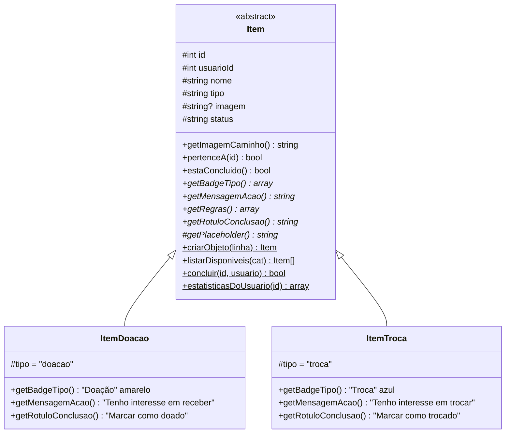
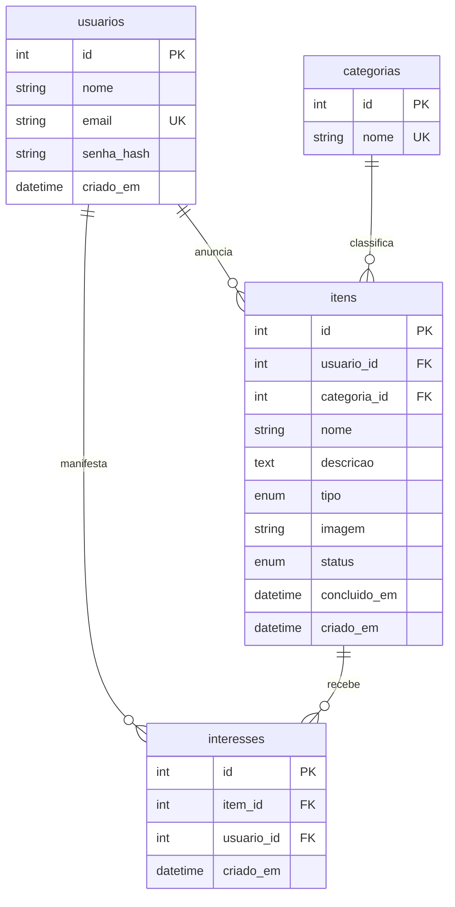

# Bazar Universitário

Plataforma web para estudantes da UNAERP **doarem e trocarem** livros, eletrônicos, materiais de estudo e móveis entre si.

Projeto acadêmico em **PHP 8 puro**, com **MVC**, **POO com herança e polimorfismo**, **MySQL via PDO** e **Bootstrap 5** na identidade visual da UNAERP (azul marinho `#0b3168`, amarelo ouro `#f4b41a` e branco). Não usa frameworks nem Composer.

🌐 **Aplicação em produção:** **http://bazar-universitario.infinityfree.me**

---

## Sumário

1. [Funcionalidades](#1-funcionalidades)
2. [Tecnologias e requisitos](#2-tecnologias-e-requisitos)
3. [Estrutura de pastas](#3-estrutura-de-pastas)
4. [Como rodar localmente (XAMPP)](#4-como-rodar-localmente-xampp)
5. [Deploy em produção (InfinityFree)](#5-deploy-em-produção-infinityfree)
6. [Arquitetura MVC](#6-arquitetura-mvc)
7. [POO: herança e polimorfismo](#7-poo-herança-e-polimorfismo)
8. [Segurança](#8-segurança)
9. [Rotas](#9-rotas)
10. [Banco de dados](#10-banco-de-dados)
11. [Desafios técnicos superados](#11-desafios-técnicos-superados)
12. [Roteiro da apresentação (15 min)](#12-roteiro-da-apresentação-15-min)
13. [Solução de problemas](#13-solução-de-problemas)

---

## 1. Funcionalidades

| Módulo | O que faz |
|---|---|
| **Autenticação** | Cadastro, login e logout. Senhas guardadas com `password_hash()` . |
| **Vitrine pública** | Grid de cards com foto, tipo (Doação/Troca), categoria e data. Filtro por categoria. Só mostra itens **disponíveis**. |
| **CRUD de itens** | Anunciar, ver, editar e excluir. Somente o **dono** edita, conclui ou exclui. |
| **Upload de foto**  | JPG, PNG ou WEBP de até 2 MB, com pré-visualização. Sem foto, aparece uma imagem padrão diferente para doação e para troca. |
| **Interesse** | Um aluno logado clica em "Tenho interesse". O dono vê nome e e-mail dos interessados para combinar a entrega. |
| **Concluir item**  | "Marcar como doado/trocado" tira o item da vitrine e o leva para o **histórico** do dono. É possível reabrir. |
| **Painel do usuário**  | `/dashboard` com indicadores (anunciados, na vitrine, concluídos, interesses recebidos), abas Ativos/Histórico e os últimos interesses recebidos. |

 

---

## 2. Tecnologias e requisitos

| Camada | Tecnologia |
|---|---|
| Linguagem | PHP **8.1+** (o XAMPP atual traz o 8.2; em produção a versão fornecida pela hospedagem) |
| Banco | MySQL 8 ou MariaDB 10.4+ |
| Servidor | Apache 2.4 com `mod_rewrite` |
| Front-end | Bootstrap 5.3 e Bootstrap Icons via CDN |
| Extensões PHP | `pdo_mysql`, `mbstring`, `fileinfo` (todas vêm ativas no XAMPP) |

### Ambientes

| Ambiente | Onde roda | Endereço |
| **Desenvolvimento** | XAMPP (Apache + PHP + MySQL local) | http://localhost/bazar-universitario/public/ |
| **Produção** | InfinityFree (hospedagem compartilhada LAMP) | http://bazar-universitario.infinityfree.me |

---

## 3. Estrutura de pastas

```
bazar-universitario/
├── .htaccess                  # encaminha para public/ e bloqueia acesso a tudo fora dela
├── config/
│   └── database.php           # credenciais do banco (padrão do XAMPP)
├── public/                    # ÚNICA pasta acessível pela web
│   ├── index.php              # Front Controller: sessão, segurança, autoload, rotas
│   ├── .htaccess              # manda toda URL para o index.php
│   ├── assets/
│   │   ├── css/app.css        # tema UNAERP
│   │   ├── js/app.js          # pré-visualização da foto e confirmações
│   │   └── img/               # placeholders de doação e troca (SVG)
│   └── uploads/               # fotos enviadas (.htaccess bloqueia execução de scripts)
├── scripts/
│   └── auditar-views.php      # confere se toda saída das views está escapada
├── sql/
│   ├── schema.sql             # banco completo (instalação nova)
│   ├── migracao_etapa2.sql    # banco da Etapa 1 -> Etapa 2
│   ├── migracao_etapa3.sql    # banco da Etapa 2 -> Etapa 3
│   └── dados_demo.sql         # contas e itens para a apresentação
└── src/
    ├── Core/                  # infraestrutura reutilizável
    │   ├── Controller.php     # classe base: render, redirect, flash, CSRF, login
    │   ├── Database.php       # conexão PDO única (Singleton)
    │   ├── Router.php         # rotas GET/POST -> Controller@metodo
    │   └── Upload.php         # validação e gravação segura de imagens
    ├── Model/
    │   ├── Usuario.php
    │   ├── Categoria.php
    │   ├── Item.php           # classe ABSTRATA + persistência
    │   ├── ItemDoacao.php     # extends Item
    │   └── ItemTroca.php      # extends Item
    ├── Controller/
    │   ├── AuthController.php
    │   ├── HomeController.php
    │   └── ItemController.php
    └── View/
        ├── layout/            # header.php, footer.php
        ├── auth/              # login.php, cadastro.php
        ├── itens/             # criar, editar, _form (parcial), detalhes
        ├── home.php           # vitrine
        └── dashboard.php      # painel do usuário
```

O mesmo `.htaccess` da raiz atende aos dois ambientes. No XAMPP e no InfinityFree a pasta inteira do projeto fica dentro do diretório público do Apache (`htdocs`). Por isso ele encaminha o acesso para `public/` e devolve **403 Proibido** para `config/`, `src/`, `sql/` e `scripts/`.

---

## 4. Como rodar localmente (XAMPP)

### 4.1 Copiar o projeto

Extraia o projeto em `C:\xampp\htdocs\bazar-universitario\`. A pasta `public` deve ficar em `C:\xampp\htdocs\bazar-universitario\public`.

### 4.2 Criar o banco

Abra o **XAMPP Control Panel**, inicie **Apache** e **MySQL** e acesse http://localhost/phpmyadmin.

| Situação | Arquivo(s) a importar, na ordem |
|---|---|
| Instalação nova | `sql/schema.sql` → (opcional) `sql/dados_demo.sql` |
| Já tinha o banco da **Etapa 2** | `sql/migracao_etapa3.sql` |
| Já tinha o banco da **Etapa 1** | `sql/migracao_etapa2.sql` → `sql/migracao_etapa3.sql` |

Para importar, use a aba **Importar** → **Escolher arquivo** → **Importar**.

> A `migracao_etapa3.sql` confere cada coluna antes de criá-la. Executá-la duas vezes não causa erro.

### 4.3 Acessar

http://localhost/bazar-universitario/public/

O endereço `http://localhost/bazar-universitario/` redireciona sozinho para `public/`.

**Contas de demonstração** (criadas por `dados_demo.sql`, todas com a senha `bazar123`):

| E-mail | Papel na demo |
|---|---|
| `ana@unaerp.br` | dona de doações e trocas, com interessados |
| `bruno@unaerp.br` | interessado nos itens da Ana |
| `carla@unaerp.br` | interessada e dona de dois itens |

### 4.4 Alternativa sem Apache (servidor embutido do PHP)

```bash
php -S localhost:8000 -t public public/index.php
```

Acesse http://localhost:8000. O último argumento (`public/index.php`) faz o PHP aplicar as mesmas regras do Apache, como liberar só imagens na pasta `uploads/`.

### 4.5 Configuração

Localmente não é preciso mudar nada. `config/database.php` lê variáveis de ambiente e, quando elas não existem, usa o padrão do XAMPP:

| Variável | Padrão (XAMPP) | Para que serve |
|---|---|---|
| `DB_HOST` | `127.0.0.1` | servidor MySQL |
| `DB_NAME` | `bazar_universitario` | nome do banco |
| `DB_USER` | `root` | usuário |
| `DB_PASS` | *(vazio)* | senha |
| `APP_ENV` | `local` | `production` esconde os erros da tela |
| `APP_TZ` | `America/Sao_Paulo` | fuso horário do PHP e do MySQL |

---

## 5. Deploy em produção (InfinityFree)

**URL oficial:** **http://bazar-universitario.infinityfree.me**

A aplicação está publicada no **InfinityFree**, uma hospedagem compartilhada gratuita que já fornece **Apache, PHP e MySQL** configurados (ambiente LAMP). O planejamento inicial previa uma máquina virtual no Google Cloud. A equipe optou pela hospedagem compartilhada, em que o servidor web, o PHP e o banco já são gerenciados pelo provedor.

A publicação não exigiu nenhuma alteração na arquitetura, porque o projeto já calcula suas URLs sozinho (`BASE_URL`) e protege as pastas internas por `.htaccess`.

### 5.1 Visão geral

```
Navegador ── http://bazar-universitario.infinityfree.me
   │
   ▼
htdocs/.htaccess            ── encaminha para public/ e bloqueia config/, src/, sql/
   ▼
htdocs/public/.htaccess     ── reescreve as rotas para o Front Controller
   ▼
htdocs/public/index.php     ── aplicação MVC
   │
   ▼
MySQL hospedado no InfinityFree (servidor sqlXXX, banco com prefixo da conta)
```

### 5.2 Criar a conta e o site

1. Criar uma conta no painel de clientes do InfinityFree.
2. Criar uma hospedagem com o subdomínio gratuito `bazar-universitario.infinityfree.me`.
3. Pelo painel da hospedagem, abrir o **Control Panel**, onde ficam o gerenciador de bancos MySQL e o phpMyAdmin.

### 5.3 Criar o banco MySQL

Em **MySQL Databases**, criar um banco (por exemplo, `bazar`). O InfinityFree acrescenta automaticamente um **prefixo da conta** ao nome do banco e informa os dados de acesso na seção **MySQL Details**:

| Dado | Formato no InfinityFree | Observação |
|---|---|---|
| Servidor (host) | `sqlXXX.infinityfree.com` | **Não** é `localhost` nem `127.0.0.1` |
| Banco | `if0_XXXXXXXX_bazar` | nome com o prefixo da conta |
| Usuário | `if0_XXXXXXXX` | o mesmo usuário da hospedagem |
| Senha | senha da hospedagem | exibida no painel da conta |

### 5.4 Importar as tabelas

Na hospedagem compartilhada **não é permitido criar bancos por SQL**: o banco já foi criado no painel e tem outro nome. Por isso, os scripts precisam ser importados **sem** as linhas que criam ou selecionam o banco `bazar_universitario`.

1. Fazer uma cópia de `sql/schema.sql` e apagar estas linhas do início:
   ```sql
   CREATE DATABASE IF NOT EXISTS bazar_universitario
       CHARACTER SET utf8mb4
       COLLATE utf8mb4_unicode_ci;

   USE bazar_universitario;
   ```
2. No **phpMyAdmin** do InfinityFree, **selecionar o banco** `if0_XXXXXXXX_bazar` na coluna da esquerda.
3. Aba **Importar** → escolher a cópia editada → **Importar**.
4. (Opcional, para a apresentação) Repetir o processo com `sql/dados_demo.sql`, removendo também a linha `USE bazar_universitario;`.

O resultado esperado são as tabelas `usuarios`, `categorias`, `itens` e `interesses`, com as cinco categorias padrão.

### 5.5 Configurar a conexão com o banco

Na cópia do projeto que será enviada ao servidor, ajustar os **valores padrão** de `config/database.php` com os dados do item 5.3:

```php
return [
    'host'    => $env('DB_HOST', 'sqlXXX.infinityfree.com'),
    'dbname'  => $env('DB_NAME', 'if0_XXXXXXXX_bazar'),
    'user'    => $env('DB_USER', 'if0_XXXXXXXX'),
    'pass'    => $env('DB_PASS', 'SENHA_DA_HOSPEDAGEM'),
    'charset' => 'utf8mb4',
];
```

> 🔒 Essa versão com a senha real existe **apenas no servidor**. A cópia entregue no repositório e usada no XAMPP mantém os valores locais (`root` sem senha), e a senha de produção nunca é versionada.

Recomenda-se também que, **no servidor**, a aplicação rode em modo de produção, para que mensagens técnicas de erro não apareçam na tela. Em `public/index.php`, o valor padrão de `APP_ENV` passa de `'local'` para `'production'`:

```php
define('APP_ENV', (string) ($_SERVER['APP_ENV'] ?? getenv('APP_ENV') ?: 'production'));
```

### 5.6 Enviar os arquivos

Os arquivos são enviados para a pasta **`htdocs/`** da hospedagem, pelo **Online File Manager** do painel ou por **FTP** (por exemplo, com o FileZilla, usando os dados de **FTP Details** do painel).

A estrutura final no servidor fica assim:

```
htdocs/
├── .htaccess          ← encaminha para public/ e bloqueia o restante
├── config/
├── public/
│   ├── .htaccess
│   ├── index.php
│   ├── assets/
│   └── uploads/
│       └── .htaccess  ← impede execução de scripts nas fotos
├── scripts/
├── sql/
└── src/
```

> ⚠️ Os arquivos `.htaccess` começam com ponto e alguns clientes FTP os escondem. Confirme que **os três** foram enviados. Sem eles, as rotas retornam 404 e as pastas internas ficam expostas.

A pasta `public/uploads/` precisa permitir **escrita** pelo PHP para receber as fotos (permissão `755`).

### 5.7 Verificação pós-deploy

Acessar **http://bazar-universitario.infinityfree.me** e conferir:

- [ ] A vitrine abre com os itens de demonstração.
- [ ] O login com `ana@unaerp.br` / `bazar123` funciona.
- [ ] Anunciar com foto funciona e a foto aparece no card.
- [ ] Abrir os detalhes de um item funciona sem "Not Found" (prova de que o `mod_rewrite` e os `.htaccess` estão ativos).
- [ ] O acesso a `http://bazar-universitario.infinityfree.me/config/database.php` e a `/sql/schema.sql` retorna **403 Proibido**.

> A hospedagem gratuita pode levar alguns minutos para ativar um subdomínio recém-criado e aplica uma verificação anti-robô no primeiro acesso. Ferramentas automatizadas (como `curl`) podem receber 403, mas navegadores comuns acessam normalmente.

### 5.8 Atualizar uma versão já publicada

1. Pelo File Manager ou FTP, substituir as pastas `src/`, `public/assets/` e os arquivos alterados.
2. **Não** sobrescrever `public/uploads/` (contém as fotos dos usuários) nem `config/database.php` (contém a senha de produção).
3. Se houver mudança no banco, importar o script de migração correspondente no phpMyAdmin, removendo a linha `USE bazar_universitario;`.

---

## 6. Arquitetura MVC

### 6.1 Caminho de uma requisição

```
Navegador
   │  GET /itens/detalhes?id=7
   ▼
Apache + .htaccess (raiz e public/)  ── encaminha para public/ e reescreve para index.php
   ▼
public/index.php (Front Controller)
   │  sessão segura, cabeçalhos de segurança, autoload, BASE_URL
   ▼
Router::dispatch()               ── "/itens/detalhes" + GET  →  ItemController@detalhes
   ▼
ItemController::detalhes()       ── CONTROLLER: regras de acesso e fluxo
   │      │
   │      ▼
   │   Item::buscarPorId(7)      ── MODEL: SQL com PDO + Prepared Statement
   │      │                         devolve um ItemDoacao ou ItemTroca
   ▼      ▼
Controller::render('itens/detalhes', [...])
   ▼
header.php + itens/detalhes.php + footer.php   ── VIEW: HTML, toda saída passa por e()
   ▼
Navegador recebe o HTML
```

### 6.2 Responsabilidades

| Camada | Pode | Não pode |
|---|---|---|
| **Model** (`src/Model`) | Falar com o banco, aplicar regras do domínio (validação, posse) | Ler `$_POST`, `$_SESSION` ou gerar HTML |
| **View** (`src/View`) | Exibir dados recebidos, sempre escapados | Fazer SQL ou decidir regras de negócio |
| **Controller** (`src/Controller`) | Ler a requisição, checar login e posse, chamar Models e escolher a View | Montar SQL ou HTML diretamente |
| **Core** (`src/Core`) | Infraestrutura comum: rotas, conexão, upload, classe base | Conhecer regras específicas do bazar |

### 6.3 Por que MVC sem framework?

- **Didático:** cada peça que o Laravel esconde (roteador, autoload, renderização) foi escrita e pode ser explicada linha a linha.
- **Separação de responsabilidades:** trocar o Bootstrap por outro CSS só mexe nas Views. Trocar MySQL por PostgreSQL só mexe no DSN.
- **Portável:** sem Composer nem dependências, o projeto roda em qualquer hospedagem com PHP e MySQL. Foi publicado em hospedagem compartilhada gratuita apenas copiando os arquivos.

---

## 7. POO: herança e polimorfismo



| Conceito | Onde aparece no código |
|---|---|
| **Abstração** | `abstract class Item`. `new Item()` gera erro: todo item é doação **ou** troca. |
| **Herança** | `ItemDoacao extends Item` reaproveita atributos, getters, `pertenceA()`, `getImagemCaminho()` e toda a persistência. |
| **Polimorfismo** | A vitrine faz só `$item->getBadgeTipo()` e `url($item->getImagemCaminho())`, sem nenhum `if (tipo == ...)`. Cada subclasse responde com seu badge, texto e placeholder. |
| **Encapsulamento** | Atributos `protected`, acesso só por getters. A View não altera o objeto. |
| **Fábrica** | `Item::criarObjeto($linha)` lê a coluna `tipo` do banco e instancia a subclasse certa. |
| **Singleton** | `Database::getConexao()`: uma única conexão PDO por requisição. |
| **Herança nos controllers** | Todos estendem `Core\Controller` e herdam `render()`, `redirect()`, `validarCsrf()` e `exigirLogin()`. |

**Exemplo para mostrar no slide** (trecho de `home.php`):

```php
<?php foreach ($itens as $item): ?>
    <?php $badge = $item->getBadgeTipo(); ?>   <!-- polimorfismo -->
    getImagemCaminho()) ?>">
    <span class="badge <?= e($badge['classe']) ?>"><?= e($badge['rotulo']) ?></span>
<?php endforeach; ?>
```

---

## 8. Segurança

| Ameaça | Defesa no projeto | Onde |
|---|---|---|
| **SQL Injection** | 100% das consultas com Prepared Statements; `ATTR_EMULATE_PREPARES = false` | `Model/*`, `Core/Database.php` |
| **XSS** | Toda saída nas views passa por `e()` (`htmlspecialchars` com `ENT_QUOTES`); `url()` já devolve escapado; CSP bloqueia scripts inline e de outros domínios | `View/*`, `public/index.php` |
| **CSRF** | Token aleatório por sessão em todo formulário POST, inclusive logout, concluir e excluir; comparação com `hash_equals` | `Core/Controller.php` |
| **Senhas vazadas** | `password_hash()` (bcrypt com salt) e `password_verify()` | `Model/Usuario.php` |
| **Sequestro de sessão** | `session_regenerate_id()` no login, cookie `HttpOnly` + `SameSite=Lax` (+ `Secure` com HTTPS), `use_strict_mode` | `index.php`, `AuthController` |
| **Acesso ao item de outro usuário** | Posse verificada **duas vezes**: no controller (`carregarItemDoDono`) e no `WHERE usuario_id = ?` do UPDATE/DELETE | `ItemController`, `Item` |
| **Upload malicioso** | Ver lista abaixo | `Core/Upload.php` |
| **Clickjacking** | `X-Frame-Options: SAMEORIGIN` e `frame-ancestors 'self'` | `index.php` |
| **Vazamento de erros** | Em produção (`APP_ENV=production`), os erros vão só para o log, e o usuário vê uma página amigável | `index.php` |
| **Arquivos sensíveis expostos** | O `.htaccess` da raiz libera apenas `public/` e responde 403 para `config/`, `src/` e `sql/`, tanto no XAMPP quanto no InfinityFree | `.htaccess` |
| **Credenciais no código** | A senha de produção existe só na cópia do servidor; o repositório mantém os valores do XAMPP | `config/database.php` |
| **Open redirect** | Volta para a página anterior só se o Referer for do próprio site | `Controller::paginaAnterior()` |

### Upload: oito verificações

Nada que vem do navegador é confiável: `$_FILES['type']` e o nome do arquivo podem ser forjados.

1. Código de erro do PHP (`UPLOAD_ERR_*`) traduzido em mensagem amigável.
2. `is_uploaded_file()`: o arquivo veio mesmo de um upload HTTP.
3. Tamanho medido no disco, com máximo de **2 MB**.
4. Extensão do nome na lista `jpg`, `jpeg`, `png`, `webp`.
5. **MIME real** lido dos bytes do arquivo com `finfo`.
6. A extensão precisa **bater** com o conteúdo (um `.jpg` que na verdade é PNG é recusado).
7. `getimagesize()` confirma que é uma imagem válida, com no máximo 6000 px por lado.
8. O arquivo é salvo com **nome aleatório** (`bin2hex(random_bytes(16))`) e a **extensão escolhida pelo servidor** a partir do MIME real.

Como segunda barreira, `public/uploads/.htaccess` só serve `.jpg`, `.png` e `.webp` e desativa a execução de scripts na pasta.

**Auditoria de XSS:** `php scripts/auditar-views.php` lê todas as views e lista cada saída que não passa por uma função de escape. Hoje sobram 12 itens para conferir, e todos imprimem só texto fixo (como `' ativo'`) ou uma URL que já veio de `url()`.

---

## 9. Rotas

| Método | URL | Ação | Acesso |
|---|---|---|---|
| GET | `/` | `HomeController@index` (vitrine, `?categoria=X`) | público |
| GET | `/itens/detalhes?id=X` | `ItemController@detalhes` | público (item concluído: só o dono) |
| GET/POST | `/login` | `AuthController@login` / `@autenticar` | visitante |
| GET/POST | `/cadastro` | `AuthController@cadastro` / `@registrar` | visitante |
| POST | `/logout` | `AuthController@logout` | logado |
| GET/POST | `/itens/criar` | `ItemController@criar` / `@salvar` | logado |
| GET/POST | `/itens/editar` | `ItemController@editar` / `@atualizar` | dono |
| POST | `/itens/deletar` | `ItemController@deletar` | dono |
| POST | `/itens/concluir` | `ItemController@concluir` | dono |
| POST | `/itens/reabrir` | `ItemController@reabrir` | dono |
| POST | `/itens/interesse` | `ItemController@manifestarInteresse` | logado, não dono |
| GET | `/dashboard` | `ItemController@dashboard` | logado |
| GET | `/meus-itens` | redireciona para `/dashboard` (compatibilidade com a Etapa 2) | logado |

As rotas são relativas ao endereço base da aplicação, que o sistema calcula automaticamente (`BASE_URL`), tanto no XAMPP quanto no InfinityFree.

---

## 10. Banco de dados



- `itens.tipo` (`doacao` | `troca`) decide a subclasse PHP.
- `itens.status`: `disponivel` → `reservado` → `concluido`. A vitrine mostra só `disponivel`.
- `UNIQUE (item_id, usuario_id)` em `interesses`: o mesmo aluno não registra interesse duas vezes no mesmo item.
- `ON DELETE CASCADE`: excluir um item apaga os interesses dele. `RESTRICT` impede apagar uma categoria que ainda tem itens.

---

## 11. Desafios técnicos superados

1. **Mesmas URLs em ambientes diferentes.** No XAMPP o site fica em `/bazar-universitario/public/`; em produção, no domínio próprio da hospedagem. A constante `BASE_URL` é calculada a partir de `SCRIPT_NAME`, e todos os links e redirecionamentos passam por `url()`/`redirect()`. Nenhum caminho foi fixado no código, e o deploy não exigiu alterar nenhuma rota.
2. **Roteador sem parâmetros na URL.** Para manter o `Router` simples (comparação exata de rotas), o ID vai na query string (`?id=7`) nos GET e em campo oculto nos POST, sempre validado com `filter_var(..., FILTER_VALIDATE_INT)`.
3. **Herança a partir de dados do banco.** O PDO devolve arrays, não objetos. A fábrica `Item::criarObjeto()` transforma cada linha em `ItemDoacao` ou `ItemTroca` conforme a coluna `tipo`.
4. **Regra de posse à prova de URL forjada.** Esconder o botão "Editar" não basta. A posse é conferida no controller **e** no SQL (`WHERE usuario_id = ?`).
5. **Upload seguro.** Descobrimos que `$_FILES['type']` vem do navegador e pode ser falsificado. A validação passou a usar os bytes do arquivo (`finfo`, `getimagesize`) e o servidor escolhe nome e extensão.
6. **Erro silencioso do `post_max_size`.** Quando o envio passa do limite do `php.ini`, o PHP descarta `$_POST` inteiro e o usuário via "sessão expirada" (falha de CSRF). Agora o sistema detecta o caso e mostra "a foto deve ter no máximo 2 MB".
7. **Arquivos órfãos.** A ordem importa: salvar a foto → gravar no banco → só então apagar a foto antiga. Se o banco falhar, a foto nova é removida.
8. **Migrações compatíveis com o MariaDB do XAMPP.** O MariaDB 10.4 não tem `RENAME INDEX`, e o MySQL não tem `ADD COLUMN IF NOT EXISTS`. Usamos `information_schema` com SQL dinâmico, e a renomeação de valores de ENUM foi feita em três passos.
9. **Fuso horário.** O XAMPP vem com `Europe/Berlin`, e servidores de hospedagem costumam operar em UTC. Itens concluídos às 23h apareciam com a data do dia seguinte. O PHP passou a usar `America/Sao_Paulo`, e a conexão ajusta o `time_zone` do MySQL para o mesmo deslocamento.
10. **Content-Security-Policy.** Para bloquear scripts injetados, todo JavaScript saiu do HTML e foi para `assets/js/app.js`.
11. **Deploy em hospedagem compartilhada.** Sem acesso à configuração do Apache (`DocumentRoot`), a proteção das pastas internas ficou a cargo do `.htaccess` da raiz, o mesmo usado no XAMPP. O banco do provedor tem nome com prefixo e servidor próprio, então os scripts SQL foram importados no banco já selecionado, sem as instruções `CREATE DATABASE`/`USE`.

---

## 12. Roteiro da apresentação (15 min)

Sugestão para uma equipe de 4 pessoas. Ajuste os nomes e tempos à equipe.

| Tempo | Quem | Conteúdo | Apoio |
|---|---|---|---|
| 0:00–1:30 | Integrante 1 | **Problema e solução:** material parado em casa, alunos precisando; o bazar conecta os dois sem dinheiro envolvido. | Slide + vitrine aberta |
| 1:30–5:00 | Integrante 1 | **Demonstração ao vivo** (roteiro abaixo) | Sistema no ar em http://bazar-universitario.infinityfree.me |
| 5:00–7:30 | Integrante 2 | **Arquitetura MVC:** caminho de uma requisição (seção 6.1) e por que não usar framework | Diagrama 6.1 |
| 7:30–10:00 | Integrante 3 | **POO:** classe abstrata `Item`, `ItemDoacao` e `ItemTroca`, polimorfismo na vitrine, fábrica `criarObjeto()` | Diagrama 7 + trecho de `home.php` |
| 10:00–12:30 | Integrante 4 | **Segurança:** Prepared Statements, `e()`, CSRF, posse em duas camadas, as oito verificações do upload (mostrar o `shell.jpg` sendo recusado) | Tabela 8 |
| 12:30–14:00 | Integrante 4 | **Deploy no InfinityFree** (hospedagem LAMP, `.htaccess` protegendo as pastas internas, banco MySQL hospedado) e **dois desafios** da seção 11 | Seção 5 |
| 14:00–15:00 | Todos | Perguntas | |

### Roteiro da demonstração (3 min e 30 s)

Antes de começar, confirme que os dados de demonstração estão no banco de produção e deixe **duas janelas** abertas em http://bazar-universitario.infinityfree.me: uma normal (Ana) e uma anônima (Bruno).

1. **Visitante:** abrir a vitrine e filtrar por "Livros". Mostrar os badges amarelo (doação) e azul (troca).
2. **Bruno:** entrar como `bruno@unaerp.br`, abrir a calculadora da Carla e clicar em "Tenho interesse em trocar". Aparece a mensagem de sucesso.
3. **Ana:** entrar, anunciar um item **com foto** e mostrar a pré-visualização. Depois mostrar que o item apareceu na vitrine.
4. **Ana:** abrir o "Cálculo Vol. 1" e mostrar a tabela de interessados com nome e e-mail.
5. **Ana:** clicar em "Marcar como doado", mostrar que o item sumiu da vitrine e abrir o **Painel**: indicadores atualizados e aba Histórico.
6. **Bônus de segurança:** como Bruno, colar a URL de edição de um item da Ana (`/itens/editar?id=1`). Aparece "Acesso negado".

> **Plano B:** se a internet ou a hospedagem falharem durante a apresentação, a mesma demonstração roda no XAMPP (seção 4), com os mesmos dados de `dados_demo.sql`.

### Perguntas prováveis

- **Por que não Laravel?** O objetivo da disciplina é entender o que o framework faz por baixo. Cada parte foi escrita e pode ser explicada.
- **E se dois alunos clicarem em "interesse" ao mesmo tempo?** A `UNIQUE (item_id, usuario_id)` no banco garante uma linha só, e o erro 23000 é tratado.
- **Um `.php` renomeado para `.jpg` passa?** Não: o `finfo` lê os bytes e recusa. E mesmo que passasse, a pasta `uploads/` não executa scripts.
- **Onde fica a senha do banco em produção?** Apenas no `config/database.php` do servidor, que fica fora da pasta pública e é bloqueado pelo `.htaccess` (403). O repositório mantém só os valores do XAMPP.
- **Por que hospedagem compartilhada e não uma VM?** A hospedagem já entrega Apache, PHP e MySQL configurados e mantidos pelo provedor. Como o projeto não depende de Composer nem de configuração do servidor, bastou copiar os arquivos e importar o banco.

---

## 13. Solução de problemas

### Ambiente local (XAMPP)

| Sintoma | Causa provável | Solução |
|---|---|---|
| Toda página além da inicial dá **404 Not Found** | `mod_rewrite` desligado | No `httpd.conf` do XAMPP, descomentar `LoadModule rewrite_module` e garantir `AllowOverride All` para o `htdocs`; reiniciar o Apache |
| "Não foi possível carregar os itens" | MySQL parado ou banco não importado | Iniciar o MySQL no XAMPP Control Panel; importar `sql/schema.sql` |
| `Unknown column 'concluido_em'` | Migração da Etapa 3 não executada | Importar `sql/migracao_etapa3.sql` |
| "Sessão expirada ou requisição inválida" | Página aberta há muito tempo ou cookies bloqueados | Recarregar a página (F5) e enviar de novo |

### Produção (InfinityFree)

| Sintoma | Causa provável | Solução |
|---|---|---|
| Erro **#1044 Access denied** ao importar o SQL | O script tenta criar ou usar o banco `bazar_universitario` | Remover as linhas `CREATE DATABASE` e `USE` (seção 5.4) e importar com o banco do painel selecionado |
| "Não foi possível carregar os itens" | Host, nome do banco ou senha incorretos | Conferir `config/database.php` com a seção **MySQL Details** do painel. O host **não** é `localhost` |
| Rotas retornam **404** ou pastas internas ficam acessíveis | Um `.htaccess` não foi enviado | Reenviar os três `.htaccess` (raiz, `public/`, `public/uploads/`), conferindo que o cliente FTP mostra arquivos ocultos |
| "Sem permissão de escrita em public/uploads" | Permissão da pasta | Ajustar a permissão de `public/uploads` para `755` pelo File Manager |
| Datas com 3 horas de diferença | Fuso do servidor | O sistema força `America/Sao_Paulo`; conferir se `public/index.php` e `src/Core/Database.php` são as versões da Etapa 3 |
| Erro técnico aparecendo na tela | `APP_ENV` em modo `local` | Ajustar o padrão para `production` no `index.php` do servidor (seção 5.5) |
| Site recém-criado não abre | Ativação do subdomínio | Aguardar a propagação (pode levar alguns minutos) e limpar o cache do navegador |
